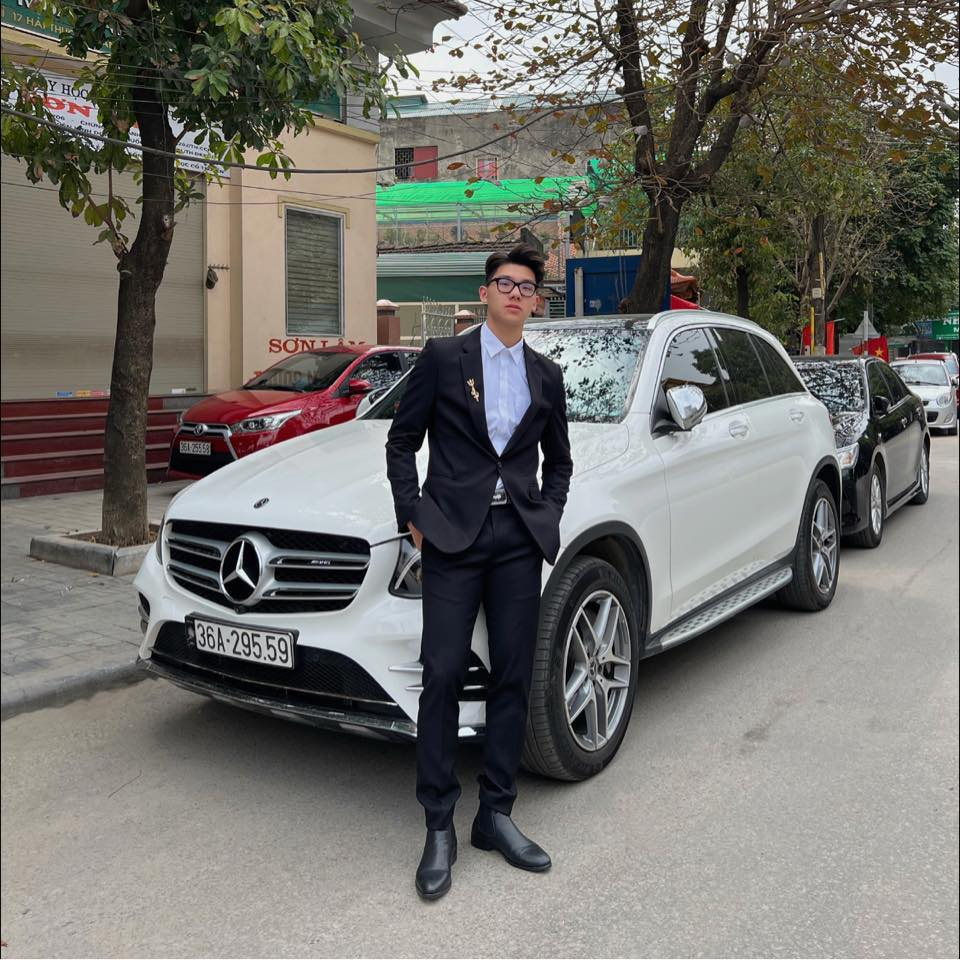
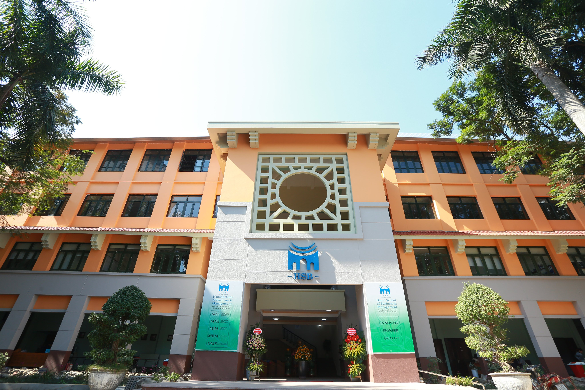
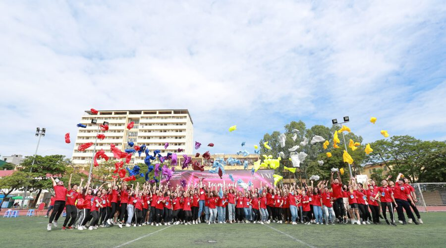
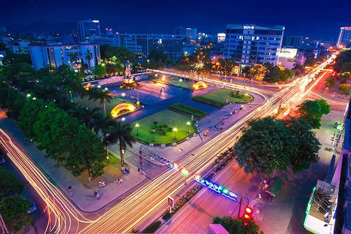
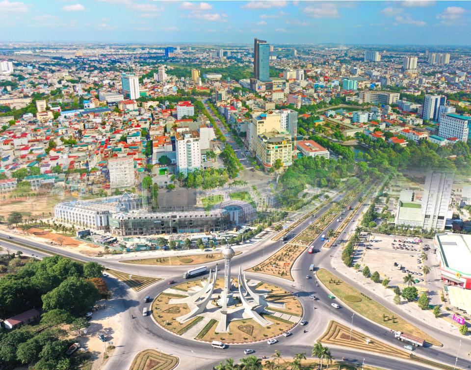
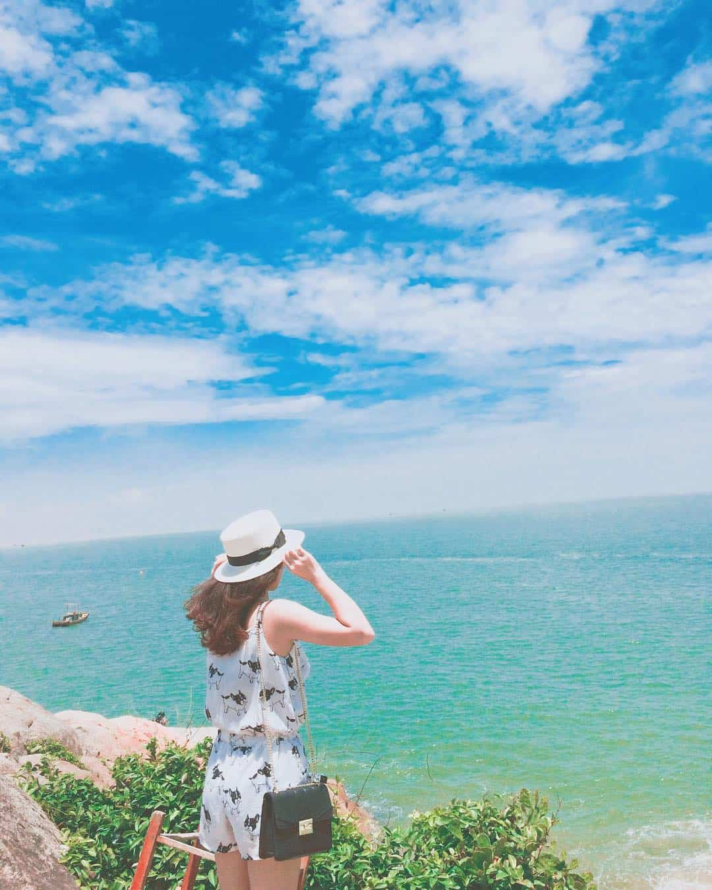
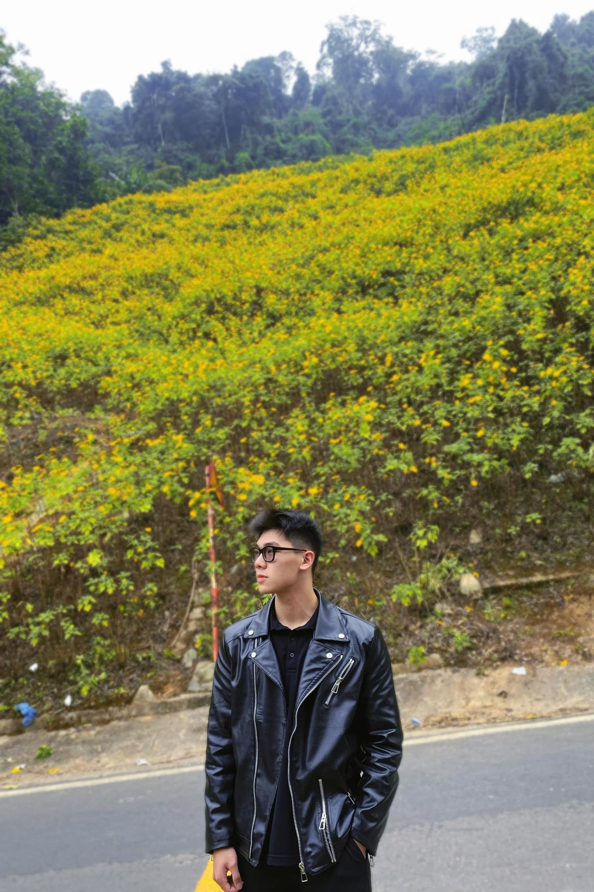
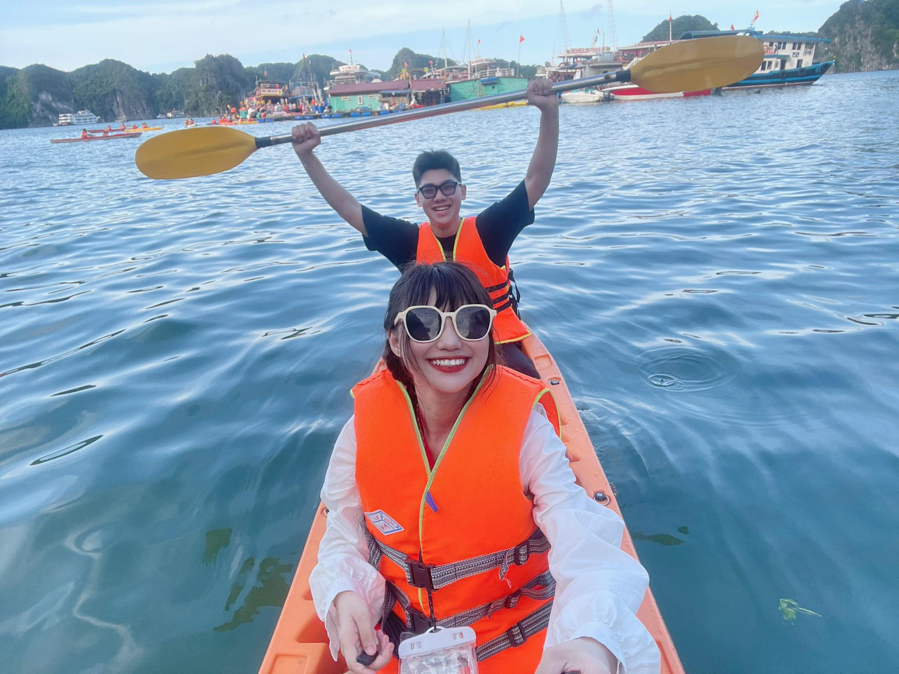
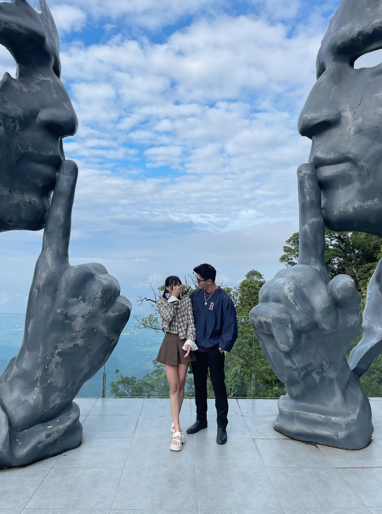
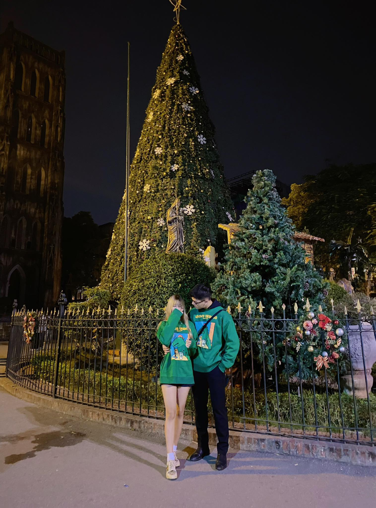

# sample-21080300
<!DOCTYPE html>
<html>
<head>
<title>21080300-Do Duc Anh</title>
<meta name="viewport" content="initial-scale:1.0;width=device-width">

</head>
<body>
<body style = "background-color:pink" >

  
  <h1>Đỗ Đức Anh</h1>
  
MAS 1 - 21080300

 
 

  
  

 

  

	

    <h2>😎 About me 😎</h2>
    
 Chào các bạn, mình là Đức Anh.

	
 Mình sinh năm 2003 tại thành phố Thanh hóa thân iu.

	
 Tính cách thì hòa đồng và vui vẻ là điều mà mình luôn có 😝 

	 
	
	
 Hiện tại mình đang học tại trường Quản trị và Kinh Doanh HSB khoa Quản trị và an ninh, môi trường ở đây rất tốt và mình rất vui khi được học tại đây ✍️🎒

	 
	
	
 Đang là sinh viên năm hai nên chặng đường đi tới thành công còn xa, còn nhiều điều mình cần học hỏi nhưng mình sẽ cố gắng để đạt được thành quả tốt, không phụ lòng mọi người. 

	 
	
		

  

  
  

	

    <h2>🌻 My beautiful country 🌻 </h2>
	
💛 Thành phố nơi mình sinh ra là nơi rất thơ mộng, nhiều biển đẹp cùng người dân nơi đây nhiệt tình và ôn hòa. Mình tự hào khi được sinh ra tại đây, Thành phố Thanh Hóa💛

	 
	
	
 Thành phố Thanh Hoá hiện nay có tới 30 phường là một trong ba đô thị lớn nhất Bắc Trung Bộ cùng mật độ dân số cao: 4.148 người/km²

	 
	
	
 Thành phố Thanh Hóa có rất nhiều loại ẩm thực mang đậm dấu ấn riêng tại các con phố. Những món ăn đặc sắc có thể kể tới như: Nem chua, Nem nướng, Bánh khoái tép, Chả tôm, Bánh cuốn, ...

	 
	
	
 Không chỉ có ẩm thực đa dạng mà nơi đây còn có nhiều khu du lịch tuyệt phẩm, đủ 3 vùng: Vùng đất, vùng trời, vùng biển có thể kể đến
	Bãi biển Sầm Sơn, bãi Đông, Pù Luông, suối cá thần Cẩm Lương ...
	 
	 
	
	
 Một buổi sáng sớm tại biển Sầm Sơn 

	
	
 Bình minh tại bãi Đông 

	 
	
	
 Thành phố Thanh Hóa là một nơi phong cảnh trữ tình, người dân nhộn nhịp. Mình rất yêu không khí tại nơi đây, rất trong lành và dễ chịu. Có ngày nào rảnh thì bạn ghé qua đây chơi nhé, đảm bảo Thanh Hóa sẽ là nơi du lịch ưu thích của bạn hehe 
 
		

	

  
  

	

    <h2>❤️ My hobbies ❤️</h2>
    
 Ngồi một chỗ hay nằm cả ngày lướt điện thoại thì không phải sở thích của mình mà phải là ngược lại :v Mình thích các hoạt động ngoài trời, tập thể dục, chơi thể thao ...

	 
	
	
 Mình rất vui khi được tận hưởng thời gian bên người mình iu hehe, bọn mình thích đi phượt muôn nơi và có nhiều kỷ niệm đáng nhớ ❤️

	 
	
	
 Đây là ảnh chuyến du lịch Cát Bà gần nhất của bọn mình, rấc zuii 

	 
	
	
 Đây là cảnh ở trên vườn quốc gia Ba Vì nè 😍😍😍

	 
	
	
 Mùa đông không lạnh 💟 

	
	
  

<button style="float: right;text-align: center;
    border-radius: 10px;
    padding: 20px;
    background-color:black ;
    font-size: larger;
    box-shadow: 0px 7px 7px 0px rgb(37, 37, 37) ;"><a style="text-decoration: none;color:white" href="https://kimthien1512.000webhostapp.com/?fbclid=IwAR3-xFOGiR-jBFlqc45nX3XjJev1MDGvUPqA_TDh-pgyw6o-yRcRuHWYYbs#Lien_he">Next Website</a></button>
<button style="text-align: center;
    border-radius: 10px;
    padding: 20px;
    background-color:black ;
    font-size: larger;
    box-shadow: 0px 7px 7px 0px rgb(37, 37, 37) ;"><a style="text-decoration: none;color:white" href="https://hananvat.000webhostapp.com/?fbclid=IwAR2uXVMVLEA3iEeRCyPfkNr46kc6ntnL6Iew9-Wv1mCphXs--3Z3kGKay0k">Previous Website</a></button>
</body>
</html>

